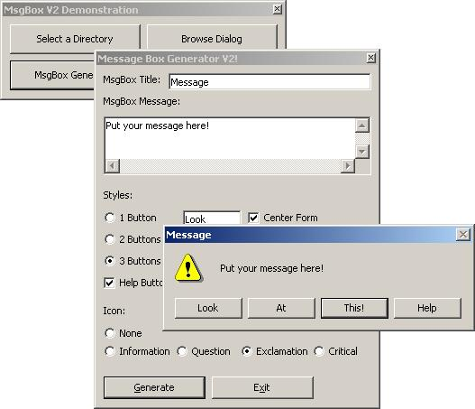



## Hooking Message Boxes\!

### Description

Download the article code. My last upload didnt go through for some reason ... !
 
### More Info
 

             |
---                |---
**Submitted On**   |2002-02-24 23:51:26
**By**             |[Andy Matteson](https://github.com/Planet-Source-Code/PSCIndex/blob/master/ByAuthor/andy-matteson.md)
**Level**          |Advanced
**User Rating**    |5.0 (10 globes from 2 users)
**Compatibility**  |VB 5\.0, VB 6\.0
**Category**       |[VB function enhancement](https://github.com/Planet-Source-Code/PSCIndex/blob/master/ByCategory/vb-function-enhancement__1-25.md)
**World**          |[Visual Basic](https://github.com/Planet-Source-Code/PSCIndex/blob/master/ByWorld/visual-basic.md)
**Archive File**   |[Hooking\_Me574042252002\.zip](https://github.com/Planet-Source-Code/andy-matteson-hooking-message-boxes__1-32098/archive/master.zip)

### Source Code

This code can change the caption of buttons.
This is how it works:
 
 
First, you need to "Hook" the message box. This allows you to change button captions and stuff.
 
 
Then, you need to do a FindWindow on the message box dialog, FindWindow("#32770", "Title"). This will retrieve the hWnd of the Message Box.
 
 
After that you need to get the hWnd of the buttons (or use the SetDlgItemText API function). To get the hWnd of the button, you do FindWindow("Button", "Button Caption").
 
 
Then you just need to send the WM_SETTEXT message to set the text of the button, and you're done! You have your custom message box. If I'm right, I think that's how it goes, as I'm just reciting from my brain right now. If I made a mistake, just download my article zip. It does everything right. No mistakes there :).

